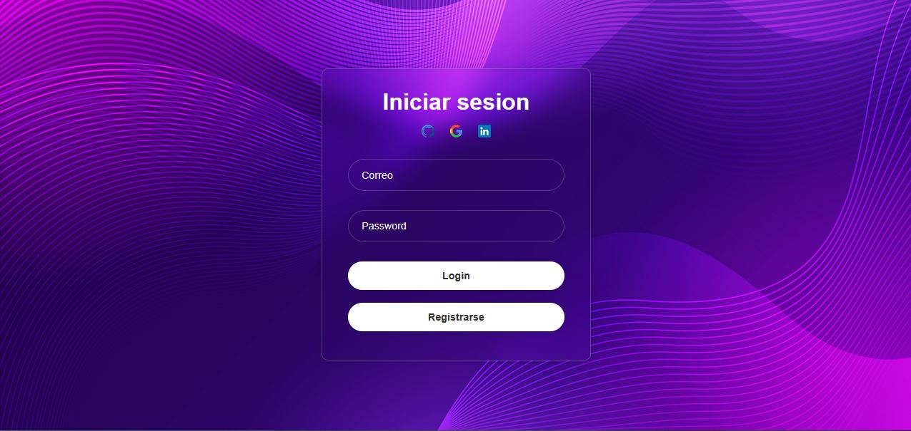
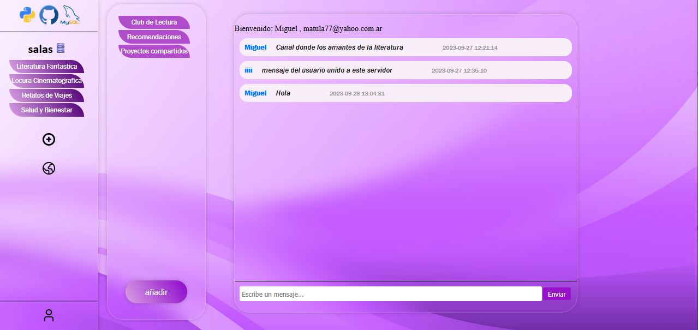

#   ""    DISCORD     ""

# Aplicacion de Mensajeria con Python, Flask, MySQL, HTML, JS, CSS

## **Documentación Técnica**

### **Introducción del Proyecto**
- **Breve descripción de la aplicación:**

    Aplicación web de mensajería inspirada en Discord, que permite:

    Registro y autenticación de usuarios.
    Creación y gestión de servidores y canales.
    Comunicación en tiempo real mediante chats.

    *   SERVIDORES: Espacio que agrupa usuarios y canales.

    *   CANALES: Subespacio dentro de un servidor para chats específicos. Solo usuarios del servidor pueden crearlos.

    *   CHAT: Historial de mensajes en un canal.


- **Propósito y objetivos del proyecto:**
    *   Proporcionar una plataforma intuitiva, responsiva y multidispositivo.
    *   Facilitar la comunicación grupal con estructura jerárquica (servidores → canales → chats).

### **Guía de Instalación**
- **Requisitos previos**
  - Python (versión 3.10 o superior)
  - Flask (versión 3.0.2 o superior)
  - mysql-connector-python (8.3.0 o superior)

###  **Instrucciones de instalación**
 1. Clona el repositorios:
     ```bash
     git clone https://github.com/CJose98/UI_web_app.git #frontend

     git clone https://github.com/CJose98/app.git #backend

     cd backenddiscord
     ```
  2. Configurar entorno virtual:
     ```bash
     py -m venv venv

     .\venv\Scripts\activate
     ```
  3. Instala dependencias:
     ```bash
     pip install -r requirements.txt
     ```
  4. Ejecutar la aplicación:
     ```bash
     py run.py
     ```

### **Configuración del entorno**
Variebale de entorno: 
[`.env`](app/.env")
  ```env
    SECRET_KEY = tu_clave_secreta
    DATABASE_USERNAME = root
    DATABASE_PASSWORD = tu_contraseña
    DATABASE_HOST = 'localhost'
    DATABASE_PORT = '3306'
  ```

### **Estructura de archivos y carpetas**
### Implementando MVC (Modelo-Vista-Controlador) en Flask

/../Discor

|--app/

|  |--controllers/      <- Lógica de negocio

|  |--models/           <- Entidades y DB

|  |--routes/           <- Blueprints de Flask

|  |--static/           <- CSS, JS, imágenes

|  |--templates/        <- Vistas HTML

|  |--init_.py/         <- Factory de la app

|  |--database.py/      <- Conexión a MySQL

|--env                  <- Entorno

|--config.py            <- Configuración global

|--requirements.txt     <- Dependencias

|--run.py               <- Ejecucion del codigo


### **Descripción de los módulos**
- **controllers**: El controlador contiene la lógica que actualiza el modelo y/o vista en respuesta a las entradas de los usuarios de la
            aplicación. En otras palabras, es una capa que permite la comunicación, organización y control entre el modelo y la vista.

- **models**: El modelo define qué datos debe contener la aplicación. Si el estado de estos datos cambia, el modelo generalmente
            notificará a la vista y, a veces, al controlador.
            En nuestras aplicaciones, el modelo especificará qué datos deben contener las entidades que participan en ella.
            En cada sistema que desarrollemos podremos identificar estas entidades, de las cuales almacenaremos datos y
            formarán parte del modelo.

-**vista**: La vista define cómo se deben mostrar los datos de nuestra aplicación. Podemos decir que, la vista es una
        representación del estado del modelo en un momento concreto y en el contexto de una acción determinada. Es
        decir, es responsable de las pantallas, páginas o cualquier tipo de interfaz con la que el usuario final de nuestra
        aplicación tendrá contacto.

    **static**: Contiene las imagenes y la logica con JavaScript.
    **templates**: Contiene la estructura en HTML.

- **routes**: Una Blueprint es una manera de organizar un grupo de componentes relacionados entre sí.
            En lugar de registrar todas las rutas de la aplicación en un único sitio, podemos agrupar rutas en diferentes
            blueprints (o planos), y luego registrar cada blueprint en la application factory.     

- **database**: Acceso a base de datos, Para realizar consultas a la base de datos necesitaremos establecer una conexión con la misma.


### **Guía de Uso:**
- **Ejemplos de uso:**

USUARIO:

-    1. **Inicio de sesión o registro**:
        Accede a la plataforma y inicia sesión con tus credenciales.
        Si eres nuevo, regístrate para crear una cuenta.

-    2. **Crear un servidor**:
        Haz clic en el ícono dedicado a la creación de servidores.
        Serás redirigido a una página donde podrás asignar un nombre a tu servidor.

-    3. **Unirse a un servidor existente**:
        Selecciona el ícono correspondiente para ver la lista de servidores disponibles.
        Elige el servidor de tu preferencia y únete con un solo clic.

-    4. **Gestionar canales en un servidor**:
        Dentro de un servidor, tienes la opción de crear canales de difusión (si cuentas con los permisos necesarios).

-    5. **Acceder a un canal**:
        Explora los canales disponibles en el servidor y selecciona uno para participar.

-    6. **Interactuar en el chat**:
        Una vez dentro de un canal, podrás comunicarte con otros miembros mediante mensajes en tiempo real.


### **Capturas de pantalla**




### **Documentación de Usuario Final**
#### Manual del Usuario:

    1. Abre la aplicación en tu navegador.
    2. Inicia sesión.
    3. Gestiona servicios (crear o unete) desde la interfaz intuitiva de la plataforma.
    4. Gestiona canales (crear o unete) desde la interfaz intuitiva de la plataforma.
    4. Interactua chat (conversa) desde la interfaz intuitiva de la plataforma.


